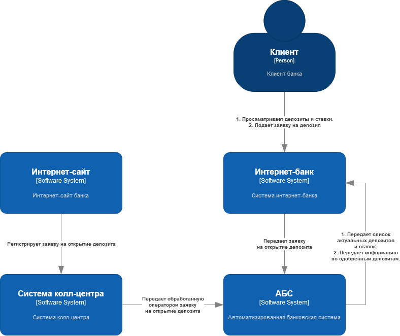
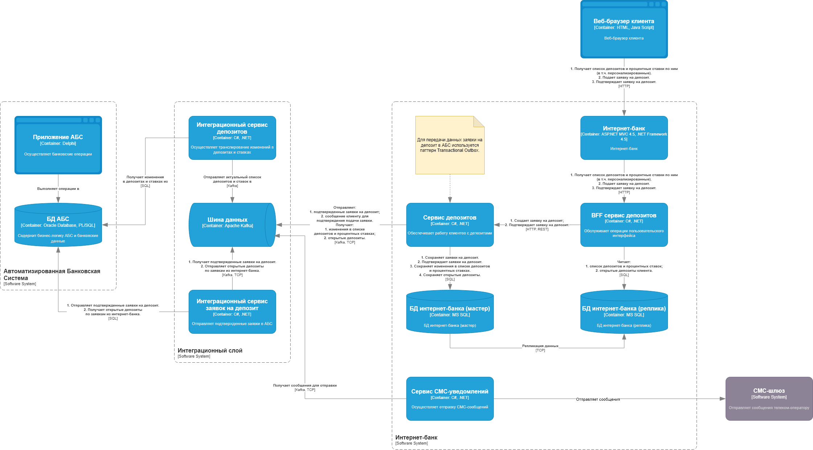

### **Название задачи: ADR1 MVP открытия депозита через интернет-банк**

### **Автор: Стеценко П. А.**

### **Дата: 18.02.2025**

### **Функциональные требования**

| № | Действующие лица или системы | Use Case | Описание |
| ----- | :---- | :---- | :---- |
| UC1 | Клиент, Сайт, Система колл-центра | Подача заявки на депозит через сайт (F2) | Находясь на сайте, клиент указывает Ф.И.О. и номер телефона на форме подачи заявки на депозит. Клиент отправляет форму. Данные с формы регистрируются в виде заявки на открытие депозита в системе колл-центра. |
| UC2 | Клиент, Интернет-банк, Сервис учета заявок на депозиты | Подача заявки на депозит через интернет-банк (F5) | Клиент выбирает интересующий депозит из списка доступных. Клиент указывает счет списания и сумму. Клиент отправляет заявку на создание депозита. Сервис учета заявок сохраняет полученную заявку. Сервис учета заявок инициирует отправку СМС-сообщения для подтверждения операции создания депозита. Клиент вводит код из СМС-сообщения и отправляет его. Сервис учета заявок получает код от клиента и подтверждает заявку. |
| UC3 | Менеджер, Сервис учета заявок на депозиты, АБС | Подтверждение заявки на депозит (F6) | Менеджер подтверждает условие депозита в интерфейсе АБС. В АБС регистрируется открытие депозита. Клиенту отправляется СМС-сообщение о факте открытия депозита и размере ставки. |

### **Нефункциональные требования**

| № | Требование |
| ----- | :---- |
| \+R1 | Задача открытия депозитов реализуется на микросервисной архитектуре. Комментарий: В дальнейшем весь интернет-банк планируется перевести на микросервисную архитектуру. |
| \+R2 |  При реализации требования F7 нужно учесть ограничение \+R1. Функция отправки СМС-сообщений не должна реализовываться в текущей системе интернет-банка. |
| \+R3 | Трафик между сайтом и системами компании должен шифроваться. |
| \+R4 | Трафик между интернет-банком и системами компании должен шифроваться. |
| \+R5 | При доработках во всех системах нужно как можно больше использовать технологии, которые уже есть в банке. Новые развертываемые технологии должны быть совместимы с существующими платформами разработки. Также желательно, чтобы внутри банка уже была экспертиза — сотрудники понимали новые технологии хотя бы на уровне языков программирования. |
| \+R6 | Если нужны очереди сообщений, то лучше использовать Kafka. Но, текущая версия платформы интернет-банка несовместима с ней. |
| \+R7 | База данных АБС уже перегружена. Необходимо избежать прямой работы интернет-банка с API АБС. |
| \+R8 | АБС может масштабироваться только вертикально из\-за своей базы данных. |
| \+R9 | Обработка персональных данных клиентов должна осуществляться в соответствии с 149-ФЗ, 152-ФЗ. |
| \+R10 | Ввиду использования микросервисной архитектуры и необходимости горизонтального масштабирования следует использовать Kubernetes для оркестрации контейнеров. |

### **Решение**

Рис. 1. Диаграмма контекста.

Рис. 2. Диаграмма контейнеров.

- Реализация задачи открытия депозитов должна строиться на микросервисной архитектуре (ограничение \+R1). Данный тип архитектуры позволит гибко разрабатывать, изменять и эксплуатировать систему. Также, это даст возможность масштабировать систему (требование P2), что способствует обеспечению свойства отказоустойчивости (требования R1, R2).  
- Функции по работе с депозитами необходимо разрабатывать в отдельных от монолита интернет-банка сервисах (ограничение \+R1). На этапе MVP монолит будет выступать фасадом для соответствующих сервисов. Это необходимо, т.к. монолит реализует ряд обязательных функций (например, аутентификация и авторизация, отрисовка пользовательского интерфейса).  
- Новые сервисы, которые реализуются в рамках MVP, должны разрабатываться с использованием платформы .NET, т.к. команда интернет-банка имеет экспертизу в работе с этой платформой и языком C\# (ограничение \+R5).  
- Ввиду того, что АБС реализована с использованием СУБД Oracle, испытывает большую нагрузку и может масштабироваться только вертикально  (ограничения \+R7, \+R8), система интернет-банка должна взять на себя  всю нагрузку по взаимодействию с клиентами.   
- Чтобы избежать влияния на АБС со стороны системы интернет-банка, необходимо реализовать асинхронное взаимодействие между ними. Взаимодействие осуществляется с использованием шины данных Apache Kafka (в режиме KRaft) (ограничение \+R6). Асинхронное взаимодействие повлечет дублирование части  клиентских данных на стороне системы интернет-банка (БД).  
- Для захвата изменений в таблицах АБС используются триггеры. Объем изменений данных ожидается небольшой, поэтому их использование не повлияет на общую производительность (+R7). Триггеры пишут изменения строк в виде json-документов в интеграционные таблицы в отдельной схеме.  
- Данные клиентов размещаются в текущей БД интернет-банка (MS SQL, ограничение \+R5). Необходимо дополнительно развернуть несколько реплик БД которые будут отвечать за чтение данных и обеспечение отказоустойчивости.  
- При хранении данных клиентов в системе интернет-банка необходимо учитывать требования к обработке персональных данных (ограничение \+R9).  
- Высокая доступность: на этапе MVP, для упрощения реализации, ввиду ограниченной клиентской базы и ускорения вывода в продуктив, используется стратегия active-standby. Необходимо разработать регламент на случай сбоя в работе ЦОД и проводить учения по переключению клиентов на резервный ЦОД.  
- Вся рабочая нагрузка системы интернет-банка выполняется на Kubernetes (ограничение \+R10).

### **Альтернативы**

1. BFF cервис депозитов может быть заменен на API gateway, т.к. предназначен для транслирования запросов сервису депозитов и чтения данных для отображения в пользовательском интерфейсе. Ввиду ограниченного скоупа функциональности в MVP, разработка отдельного сервиса будет проще, чем внедрение API gateway.  
2. Для захвата изменений в таблицах АБС может быть применен Oracle Golden Gate или Debezium, при этом, Oracle Golden Gate платный продукт. Оба варианта используют Log Miner, который оказывает нагрузку на ресурсы СУБД и требует администрирования. Поэтому, использование их в рамках MVP было бы избыточным.

### **Недостатки, ограничения, риски**

1. Риск: Интеграционный сервис депозитов строит актуальный список депозитов и ставок на основе изменений в АБС. Механизм формирования списка должен обеспечивать свойства непротиворечивости и достоверности формируемого списка.  
2. Риск: Надежность кластера Kafka. Kafka является средством обмена данных между сервисами, поэтому от его отказоустойчивости и надежности зависит работоспособность системы.  
3. Риск: Система работает на одном ДЦ. Необходимо разработать план и проводить учения по переключению нагрузки на систему в резервном ДЦ, пока не будет реализована стратегия active-active.  
4. Риск: Нагрузка от пользователей проходит через текущий монолит интернет-банка. Он должен выдерживать появление новой нагрузки от пользователей связанной с открытием депозитов.  
5. Риск: Актуальность данных которые пользователь получает в интерфейсе интернет-банка зависит от скорости репликации между мастер-БД и репликой. Репликация должна работать бесперебойно и быстро.  
6. Ограничение: Асинхронный обмен данными может приводить к задержкам обмена данными между АБС и интернет-банком, что может влиять на их актуальность.
