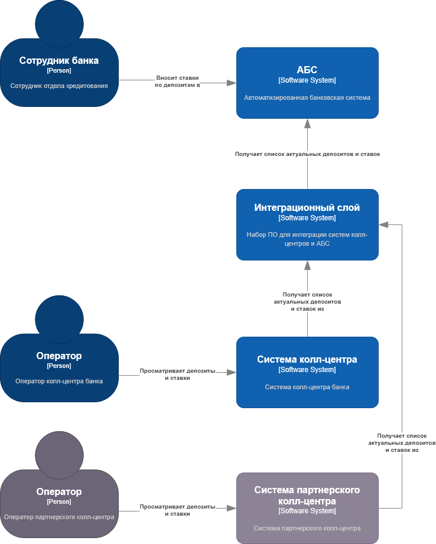
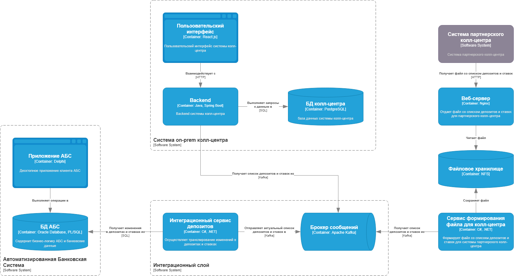

### **Название задачи: ADR 2 Передача ставок по депозитам в системы колл-центров**

### **Автор: Стеценко П. А.**

### **Дата: 18.02.2025**

### **Функциональные требования**

| № | Действующие лица или системы | Use Case | Описание |
| ----- | :---- | :---- | :---- |
| UC1 | Сотрудник отдела кредитования, АБС, система колл-центра | Передача ставок по депозитам | Сотрудник отдела кредитования вносит в АБС актуальные ставки по депозитам. Информация по ставкам депозитов транслируется в on-prem и партнерскую системы колл-центров. |
| UC2 | Клиент, сотрудник колл-центра, система колл-центра | Предоставление информации по актуальным ставкам | Клиент звонит в колл-центр для консультации по открытию депозита. Оператор сообщает клиенту актуальные ставки на основе данных, имеющихся в системе колл-центра.  |

### **Нефункциональные требования**

| № | Требование |
| ----- | :---- |
| \+R1 | Процентные ставки по депозитам передаются в партнерскую систему колл-центра в виде файла. |
| \+R2 | В системе партнерского колл-центра нет возможности сделать API-вызовы (например, через SFTP-протокол). |
| \+R3 | Канал передачи данных партнерскому колл-центру должен быть защищен шифрованием. |
| \+R4 | Доступ к файлу с процентными ставками по депозитам должен быть защищен механизмом аутентификации. |
| \+R5 | База данных АБС уже перегружена. Необходимо избежать прямой работы с API АБС. |
| \+R6 | Если нужны очереди сообщений, то лучше использовать Kafka. |

### **Решение**

 
Рис. 1. Диаграмма контекста.

 
Рис. 2. Диаграмма контейнеров.

- Системы колл-центров не выполняют прямые обращения к АБС для получения списка ставок и процентов (+R5), вместо этого они получают актуальный список из очереди Kafka (+R6).  
- “Интеграционный сервис депозитов” читает изменения в таблицах АБС относящихся к ставкам и процентам, получает из очереди последний актуальный список и применяет к нему изменения. Далее итоговый список записывает обратно в очередь.  
- Для захвата изменений в таблицах АБС относящихся к процентам и ставкам используются триггеры. Объем изменений данных ожидается небольшой, поэтому их использование не повлияет на общую производительность (+R5). Триггеры пишут изменения строк в виде json-документов в интеграционные таблицы в отдельной схеме.  
- Т.к. система партнерского колл-центра может принимать список депозитов и ставок в виде файла (+R1), то реализуется сервис “Сервис формирования файла для колл-центра” который подготавливает файл и размещает его в сетевом хранилище.  
- Для осуществления доступа системы партнерского колл-центра к файлу используется веб\-сервер (+R2). Канал обмена данными между системой партнерского колл-центра и веб\-сервером должен шифроваться с использованием TLS. Также, должен быть применен механизм аутентификации Basic (+R3, \+R4). Веб-сервер размещается в DMZ.

### **Альтернативы**

- Системы колл-центров могут получать список депозитов не из очереди Kafka, а от отдельного сервиса через REST. Это позволит абстрагироваться от способа хранения данных.

### **Недостатки, ограничения, риски**

- Риск: Доступность веб\-сервера и сетевого файлового хранилища влияют на возможность получать актуальный файл системой партнерского колл-центра.
